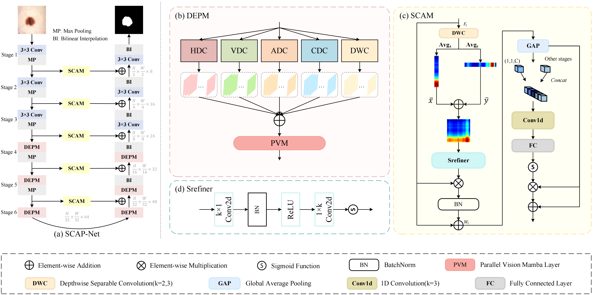
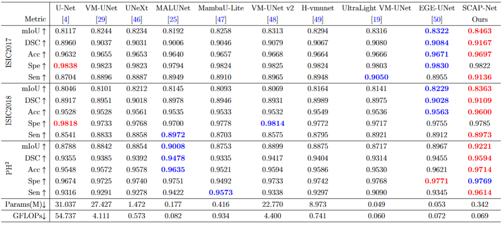

# SCAP-Net

## 0. Abstract

Skin lesion segmentation is of great significance for improving the diagnosis effect and accuracy of melanoma. However, due to the fuzzy boundaries of skin lesions and the large differences in shapes and sizes, accurate segmentation usually relies on prior information such as shape, relative position, and inclusion relationship. Most traditional methods do not make full use of this prior knowledge, which limits their feature expression capabilities. In addition, effectively distinguishing foreground and background categories is also crucial for obtaining high-quality segmentation results. To address these issues, we propose SCAP-Net, which extracts rich prior knowledge through difference convolutions and depthwise separable convolution, and combines self-calibration and channel attention modules to improve the position modeling of foreground objects. This design can effectively utilize prior information and effectively distinguish foreground and background categories. Experimental results on three public benchmark datasets, ISIC2017, ISIC2018, and PH$^2$, show that our proposed SCAP-Net outperforms other state-of-the-art methods, demonstrating the reliability of the framework. Our code is available at https://github.com/szz2025/SCAP-Net.


## 1. Overview

<div align="center">

</div>


## 2. Main Environments

The environment installation process can be carried out as follows:

```
conda create -n SCAP-Net python=3.8
conda activate SCAP-Net
pip install torch==1.13.0 torchvision==0.14.0 torchaudio==0.13.0 
pip install packaging
pip install timm==0.4.12
pip install pytest chardet yacs termcolor
pip install submitit tensorboardX
pip install triton==2.0.0
pip install causal_conv1d==1.0.0  
pip install mamba_ssm==1.0.1
pip install scikit-learn matplotlib thop h5py SimpleITK scikit-image medpy yacs
```


## 3. Datasets

You can refer to [UltraLight-VM-UNet](https://github.com/wurenkai/UltraLight-VM-UNet) for processing datasets, but for the division of the PH2 dataset, please run the Prepare_PH2.py we provide to divide the training set, validation set, and test set. Then organize the .npy file into the following format:

'./datasets/'

- ISIC2017
  - data_train.npy
  - data_val.npy
  - data_test.npy
  - mask_train.npy
  - mask_val.npy
  - mask_test.npy
- ISIC2018
  - data_train.npy
  - data_val.npy
  - data_test.npy
  - mask_train.npy
  - mask_val.npy
  - mask_test.npy
- PH2
  - data_train.npy
  - data_val.npy
  - data_test.npy
  - mask_train.npy
  - mask_val.npy
  - mask_test.npy


## 4. Train the SCAP-Net

```
python train.py
```


## 5. Test the SCAP-Net 

First, in the test.py file, you should change the address of the checkpoint in 'resume_model'.

```
python test.py
```


## 6. Comparison With State of the Arts

The performance of the proposed method is compared with the state-of-the-art models on the ISIC2017, ISIC2018, and $\text{PH}^2$ datasets, with the top two results highlighted in red and blue, respectively.

<div align="center">

</div>


## 7. Acknowledgement

Thanks to [Vim](https://github.com/hustvl/Vim), [VM-UNet](https://github.com/JCruan519/VM-UNet) and [UltraLight-VM-UNet](https://github.com/wurenkai/UltraLight-VM-UNet) for their outstanding works.
