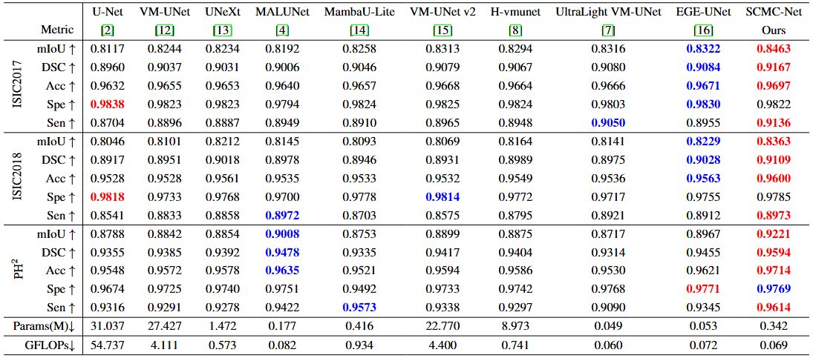

# SCMC-Net

## 0. Abstract

Due to scale variation, fuzzy boundaries, and hair interference, achieving precise skin lesion segmentation is extremely challenging. Some existing SSM-based skin lesion segmentation methods rely solely on SSM or simply combine conventional convolution with SSM as the network backbone, but these approaches often fail to fully exploit prior information and have limited ability to model foreground objects. To address these issues, we propose a novel network that embeds prior information into standard convolutions to extract edge and intensity information and integrates a self-calibrated channel attention mechanism to enhance the network’s ability to recognize foreground objects. This design improves segmentation performance on complex structures. Experiments on three benchmark skin lesion segmentation datasets demonstrate that our method consistently outperforms state-of-the-art approaches across multiple evaluation metrics, proving its robustness and effectiveness in tackling key segmentation challenges. Our code is available at https://github.com/szz2025/SCMC-Net.


## 1. Overview

<div align="center">

</div>


## 2. Main Environments

The environment installation process can be carried out as follows:

```
conda create -n SCMC-Net python=3.8
conda activate SCMC-Net
pip install torch==1.13.0 torchvision==0.14.0 torchaudio==0.13.0 
pip install packaging
pip install timm==0.4.12
pip install pytest chardet yacs termcolor
pip install submitit tensorboardX
pip install triton==2.0.0
pip install causal_conv1d==1.0.0  
pip install mamba_ssm==1.0.1
pip install scikit-learn matplotlib thop h5py SimpleITK scikit-image medpy yacs
```


## 3. Datasets

You can refer to [UltraLight-VM-UNet](https://github.com/wurenkai/UltraLight-VM-UNet) for processing datasets, but for the division of the PH2 dataset, please run the Prepare_PH2.py we provide to divide the training set, validation set, and test set. Then organize the .npy file into the following format:

'./datasets/'

- ISIC2017
  - data_train.npy
  - data_val.npy
  - data_test.npy
  - mask_train.npy
  - mask_val.npy
  - mask_test.npy
- ISIC2018
  - data_train.npy
  - data_val.npy
  - data_test.npy
  - mask_train.npy
  - mask_val.npy
  - mask_test.npy
- PH2
  - data_train.npy
  - data_val.npy
  - data_test.npy
  - mask_train.npy
  - mask_val.npy
  - mask_test.npy


## 4. Train the SCMC-Net

```
python train.py
```


## 5. Test the SCMC-Net 

First, in the test.py file, you should change the address of the checkpoint in 'resume_model'.

```
python test.py
```


## 6. Comparison With State of the Arts

The performance of the proposed method is compared with the state-of-the-art models on the ISIC2017, ISIC2018, and $\text{PH}^2$ datasets, with the top two results highlighted in red and blue, respectively.

<div align="center">

</div>


## 7. Acknowledgement

Thanks to [Vim](https://github.com/hustvl/Vim), [VM-UNet](https://github.com/JCruan519/VM-UNet) and [UltraLight-VM-UNet](https://github.com/wurenkai/UltraLight-VM-UNet) for their outstanding works.
